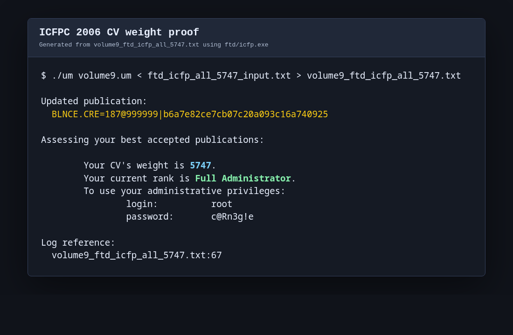

# icfpc2006

Working directory for the ICFPC 2006 puzzle.

## Solution Report

The current write-up is [solution_report.md](solution_report.md). It summarizes the solved areas, the core ideas behind each solution, and the current score state.

Current highlights:
- CV weight: 5750, Full Administrator (`volume9_ftd_icfp_all_5750.txt`).
- Smellular Antomata is complete: Puzzle 1..15 all have solution files and ANTWO publications.
- The report focuses on reusable solving structure rather than raw command history; detailed logs remain in `walkthrough.md`, `progress.md`, `*_input.txt`, and `volume9_*.txt`.



## Highlights
- UM interpreter source: `um.rs` (builds to `um`)
- O'Cult evaluator: `occult.py`
- Programs and artifacts: `*.um`, `*.umz`
- Inputs and logs: `*_input.txt`, `volume9_*.txt`
- Docs and specs: `problem.md`, `walkthrough.md`, `um_spec.txt`

## Build
```bash
rustc um.rs -O -o um
```

## Run
```bash
./um volume9.um < howie_ls_input.txt > volume9_howie_ls.txt
```

## O'Cult tests
```bash
python3 occult.py arith4.adv arith.tests
```
